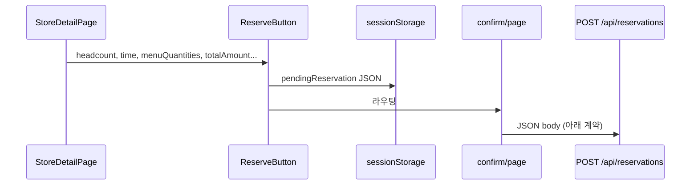

# Store 표시·예약 전송 로직 정리 및 Spring Boot 코드 계획

## 1. 가게(store) 정보를 보여주는 로직

| 위치                                                                   | 역할                                                                                                                                                          |
| -------------------------------------------------------------------- | ----------------------------------------------------------------------------------------------------------------------------------------------------------- |
| [src/app/page.tsx](src/app/page.tsx)                                 | 홈: `getAllStores()`로 목록을 가져와 `StoreCard`에 넘김. **API 호출 없음** (서버 컴포넌트에서 mock 직접 사용).                                                                         |
| [src/components/StoreCard.tsx](src/components/StoreCard.tsx)         | 카드 UI, `/stores/[id]`로 이동.                                                                                                                                  |
| [src/app/stores/[id]/page.tsx](src/app/stores/[id]/page.tsx)         | **클라이언트에서** `GET /api/stores/${storeId}`로 상세 로드. 응답 타입 `GetStoreDetailResponse`: `store`, `menus`, `availableTimes`, `reservedTimes`. 인원·시간·메뉴 수량 state 관리. |
| [src/app/api/stores/route.ts](src/app/api/stores/route.ts)           | `GET /api/stores` — 목록용 `StoreCard[]` (`GetStoresResponse`).                                                                                                |
| [src/app/api/stores/[id]/route.ts](src/app/api/stores/[id]/route.ts) | `GET /api/stores/:id` — 상세 `store` + `menus` + 시간 배열.                                                                                                       |
| [src/types/index.ts](src/types/index.ts)                             | `StoreCard`, `StoreDetail`, `GetStoresResponse`, `GetStoreDetailResponse`, `MenuItemData`, `MinOrderRule` 정의.                                               |
| [src/lib/mock-data.ts](src/lib/mock-data.ts)                         | 실제 데이터 소스(인메모리). Notion 연동은 [src/lib/notion.ts](src/lib/notion.ts) 등 별도 경로.                                                                                 |

**데이터 흐름(상세 페이지):** 브라우저 → Next `GET /api/stores/:id` → mock `getStoreById` → JSON 반환.

---

## 2. 예약(reservation)을 전송하는 로직

| 위치                                                                           | 역할                                                                                                                                                                      |
| ---------------------------------------------------------------------------- | ----------------------------------------------------------------------------------------------------------------------------------------------------------------------- |
| [src/components/ReserveButton.tsx](src/components/ReserveButton.tsx)         | 시간·최소주문 검증 후 `pendingReservation`을 **sessionStorage**에 저장하고 `/stores/{id}/confirm`으로 이동. 본문에는 `menuId`, `name`, `price`, `quantity` 포함(확인 화면 표시용).                      |
| [src/app/stores/[id]/confirm/page.tsx](src/app/stores/[id]/confirm/page.tsx) | sessionStorage에서 읽은 뒤 `**fetch('/api/reservations', { method: 'POST', body: JSON.stringify({...}) })`** 로 전송. `menuItems`는 **서버로 `menuId`와 `quantity`만** 보냄.            |
| [src/app/api/reservations/route.ts](src/app/api/reservations/route.ts)       | 본문 파싱 → 가게 존재 확인 → [src/lib/validation.ts](src/lib/validation.ts) `validateReservationRequest` → `createReservation` → (Slack) → **201** + `CreateReservationResponse`. |
| [src/types/index.ts](src/types/index.ts)                                     | `CreateReservationRequest`, `CreateReservationResponse` 정의.                                                                                                             |

**프론트엔드가 실제로 보내는 JSON (백엔드 DTO와 1:1 대응):**

- `storeId`: string  
- `headcount`: number  
- `time`: string (예: `"18:00"`)  
- `menuItems`: `{ menuId: string, quantity: number }[]`  
- `totalAmount`: number  
- `minOrderAmount`: number

**성공 응답(201):** `{ "reservationId": string, "status": "pending" }` — [CreateReservationResponse](src/types/index.ts).

**실패 시:** 404 `{ error }`, 400 `{ errors: string[] }`, 500 `{ error }` — 컨트롤러에서 동일 형태를 맞추면 프론트 [confirm/page.tsx](src/app/stores/[id]/confirm/page.tsx)의 에러 처리와 호환됩니다.

---

## 3. Spring Boot 쪽 구현 방향 (요청하신 3개 파일)

### 3.1 `ReservationRequestDTO`

- 필드명·타입을 **위 JSON과 동일**하게 유지 (`storeId`, `headcount`, `time`, `menuItems`, `totalAmount`, `minOrderAmount`).
- 중첩: `List<ReservationMenuItemRequestDto>` 또는 정적 내부 클래스 `MenuItemRequest { String menuId; Integer quantity; }`.
- 선택: `jakarta.validation`으로 `@NotBlank`, `@NotNull`, `@Min(1)` 등을 붙여 서버 측 검증 강화(프론트 [validation.ts](src/lib/validation.ts)와 같은 규칙은 서비스 레이어에서 가게 정보 조회 후 구현).

### 3.2 `Reservation` (JPA Entity)

- **요청 DTO와 동일한 정보를 저장**하려면: `storeId`, `headcount`, `time`, `totalAmount`, `minOrderAmount` + 라인 아이템(`menuId`, `quantity`).
- 프론트가 보내지 않는 **서버 전용 필드**: `@GeneratedValue` `id`, `status`(enum: 최소 `PENDING`), `createdAt`.
- `menuItems`: `@Embeddable` + `@ElementCollection` 또는 `@OneToMany` 자식 엔티티. 한 파일에 `@Embeddable MenuItemSelection`을 두어 **사용자가 요청한 Entity 파일 하나**로 끝낼 수 있음.
- 금액: `Integer` 또는 `Long`(원 단위 정수). `time`은 프론트가 `"HH:mm"` 문자열이므로 `String` 유지 권장.

### 3.3 `ReservationController`

- `@PostMapping("/api/reservations")` (또는 `server.servlet.context-path`로 prefix 분리 시 경로만 조정).
- `@RequestBody ReservationRequestDTO` → 서비스에서 Entity로 매핑 후 저장.
- **201 Created** + body: `reservationId`(String, DB id를 `String.valueOf` 또는 UUID 문자열로), `status: "pending"` — 프론트 `CreateReservationResponse`와 일치.
- `@RestControllerAdvice`로 400/404/500 JSON 형태를 Next API와 비슷하게 맞추면 교체 시 유리(필수는 아님).

**CORS:** 프론트가 Next(다른 origin)에서 스프링 URL로 직접 POST할 경우 `WebMvcConfigurer`에서 CORS 설정 필요. 동일 도메인 리버스 프록시면 불필요.

---

## 4. 구현 시 주의

- 이 레포의 예약 저장은 [MockReservation](src/lib/mock-data.ts)처럼 라인에 `name`, `priceAtTime`을 풀 수 있지만, **POST 본문에는 없음**. 스프링에서도 메뉴 마스터를 조인해 채우거나, 최소한 `menuId`/`quantity`만 저장하는 설계가 프론트 계약과 일치합니다.
- 홈 [page.tsx](src/app/page.tsx)는 현재 API를 쓰지 않으므로, 백엔드에서 가게 API만 제공할 때는 **상세/목록 fetch URL**을 스프링으로 바꾸는 프론트 수정이 별도로 필요합니다(이번 범위의 예약 POST만이면 위 DTO/Entity/Controller로 충분).

---

## 5. 산출물 (승인 후 코드 작성 시)

승인되면 아래 3개 Java 파일 내용을 프로젝트에 맞는 패키지명으로 제시합니다.

1. `Reservation.java` — JPA 엔티티 + (필요 시 같은 파일에 `@Embeddable` 메뉴 라인).
2. `ReservationRequestDTO.java` — 요청 DTO + 중첩 클래스.
3. `ReservationController.java` — `ReservationRepository` 주입, POST 핸들러, 응답 맵 또는 소형 응답 record/class.

`ReservationRepository extends JpaRepository<Reservation, Long>` 한 줄은 편의상 같이 제시할 수 있으나, 요청 범위는 명시된 3가지 클래스에 한정합니다.