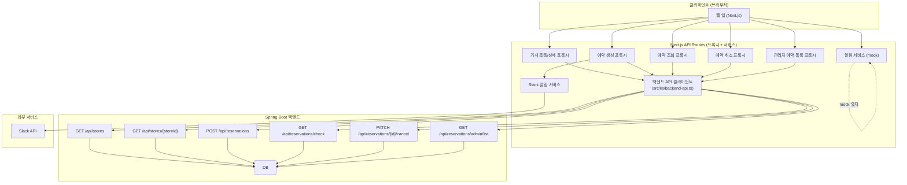
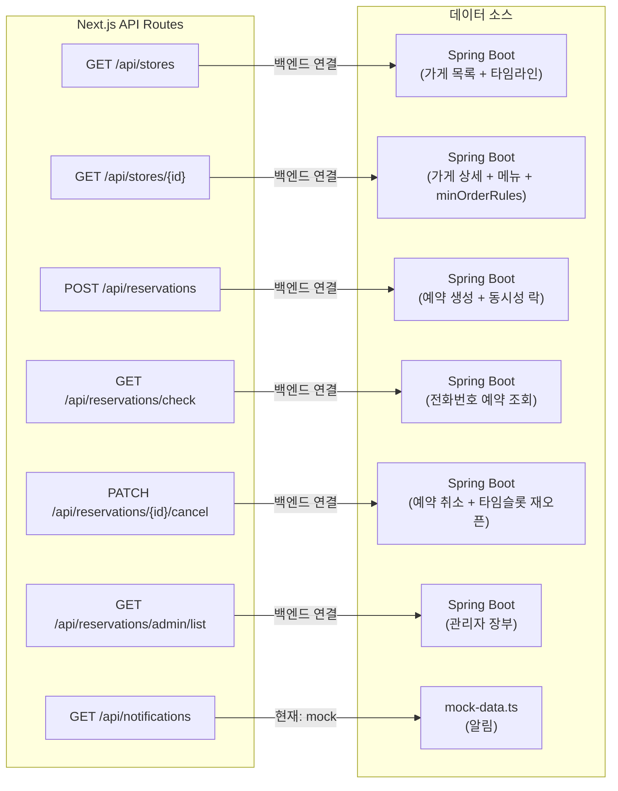
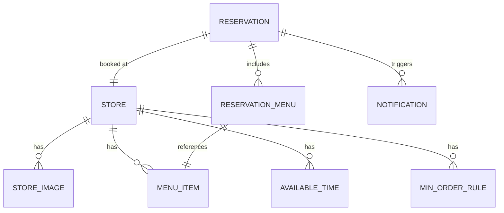

# 기술 설계 문서: 단체 예약 플랫폼

## 개요

단체 예약 플랫폼은 사용자가 메인 홈에서 가게 카드를 탐색하고, 상세 화면에서 인원/시간 선택 및 메뉴 추가 후 예약을 진행하는 간소화된 단체 예약 서비스이다. 가게 데이터는 백엔드 DB에서 관리된다. 예약이 접수되면 Slack을 통해 운영팀에 알림이 전달되며, 운영팀은 수락/거절 및 추가 안내사항을 전달할 수 있다. 운영팀의 처리 결과는 사이트 내 알림을 통해 사용자에게 전달된다.

백엔드 개발자가 Spring Boot로 구현한 API 서버가 가게 탐색, 가게 상세, 예약 생성, 예약 조회, 예약 취소, 관리자 장부 조회를 제공한다. 알림(notifications) 기능만 아직 백엔드 API가 없어 mock 데이터를 유지하며, API가 준비되면 즉시 전환할 수 있는 서비스 레이어 구조를 갖춘다. 백엔드 API 응답은 공통 래퍼 형식 `{ success: true, data: ... }` / `{ success: false, message: "..." }`을 따르며, 관리자 장부 조회 API만 예외적으로 순수 배열을 반환한다.

핵심 흐름:
1. 사용자가 메인 홈에서 날짜/인원수 선택 후 가게 카드 탐색
3. 가게 카드 클릭 → 상세 화면에서 시간 선택 + 메뉴 추가 (최소 주문 금액 충족 필요)
4. "예약하기" 클릭 → 예약 확인 화면 → "예약 확정" 클릭
5. Next.js API Route → Spring Boot 백엔드로 예약 데이터 전달 (API 프록시 패턴)
6. 운영팀에 Slack 알림 → 수락/거절/추가 안내사항 전달
7. 운영팀 수락/거절 → 사이트 내 알림으로 사용자에게 결과 전달

## 아키텍처

### 시스템 아키텍처



### 기술 스택

- **프론트엔드**: Next.js (App Router), TypeScript, Tailwind CSS
- **API 레이어**: Next.js API Routes (프록시 + 서비스)
- **백엔드**: Spring Boot (가게 탐색/상세, 예약 생성/조회/취소, 관리자 장부 조회)
- **프론트엔드 데이터**: Mock 데이터 (알림만 - 백엔드 API 추가 시 전환)
- **외부 연동**: Slack API (Incoming Webhooks + Interactive Messages)
- **배포**: Vercel

### 백엔드 API 연결 아키텍처

#### API 프록시 패턴

클라이언트(브라우저)는 Spring Boot 백엔드에 직접 접근하지 않는다. 모든 백엔드 통신은 Next.js API Route를 통해 서버 사이드에서 이루어진다.

```
브라우저 → Next.js API Route → Spring Boot 백엔드
```

이 패턴의 장점:
- 클라이언트에 백엔드 서버 주소가 노출되지 않음
- CORS 이슈 없이 서버 간 통신
- 요청/응답 데이터 변환을 서버 사이드에서 처리
- 환경별(로컬/스테이징/프로덕션) 백엔드 주소를 환경 변수로 관리

#### 백엔드 공통 응답 래퍼 처리

백엔드 API는 공통 응답 포맷을 사용한다:
- 성공: `{ "success": true, "data": { ... } }`
- 실패: `{ "success": false, "message": "에러 내용" }`
- 예외: GET /api/reservations/admin/list만 순수 배열 `[ ]`

#### 백엔드 API 클라이언트 모듈 (`src/lib/backend-api.ts`)

```typescript
// 환경 변수 기반 백엔드 API Base URL
const BACKEND_API_URL = process.env.BACKEND_API_URL || 'http://localhost:8080';

// 백엔드 공통 응답 래퍼 타입
interface BackendResponse<T> {
  success: boolean;
  data?: T;
  message?: string;
}

// 공통 응답 래퍼 파싱 함수
function parseBackendResponse<T>(response: BackendResponse<T>): T {
  if (!response.success) {
    throw new BackendApiError(400, response.message || '요청 처리에 실패했습니다.');
  }
  return response.data as T;
}

// 공통 fetch 래퍼 (래퍼 파싱 통합)
async function backendFetch<T>(
  path: string,
  options?: RequestInit & { rawResponse?: boolean },
): Promise<T> {
  const url = `${BACKEND_API_URL}${path}`;
  const response = await fetch(url, {
    ...options,
    headers: {
      'Content-Type': 'application/json',
      ...options?.headers,
    },
  });

  if (!response.ok) {
    const body = await response.text();
    // 실패 응답도 래퍼 형식일 수 있음
    try {
      const parsed = JSON.parse(body) as BackendResponse<unknown>;
      if (parsed.success === false) {
        throw new BackendApiError(response.status, parsed.message || body);
      }
    } catch (e) {
      if (e instanceof BackendApiError) throw e;
    }
    throw new BackendApiError(response.status, body);
  }

  const contentType = response.headers.get('content-type');
  if (contentType?.includes('application/json')) {
    const json = await response.json();
    // rawResponse 옵션: 래퍼 파싱 없이 원본 반환 (admin/list 등)
    if (options?.rawResponse) return json as T;
    // 공통 래퍼 파싱 시도
    if (json && typeof json === 'object' && 'success' in json) {
      return parseBackendResponse<T>(json as BackendResponse<T>);
    }
    return json as T;
  }
  return response.text() as unknown as T;
}

// 백엔드 API 에러 클래스
class BackendApiError extends Error {
  constructor(
    public statusCode: number,
    public responseBody: string,
  ) {
    super(`Backend API error: ${statusCode}`);
  }
}

// --- 가게 목록 조회 ---
async function getStores(date: string, headcount: number): Promise<StoreListData> {
  return backendFetch<StoreListData>(
    `/api/stores?date=${date}&headcount=${headcount}`
  );
}

// --- 가게 상세 조회 ---
async function getStoreDetail(storeId: string, date: string): Promise<StoreDetailData> {
  return backendFetch<StoreDetailData>(
    `/api/stores/${storeId}?date=${date}`
  );
}

// --- 예약 생성 ---
interface BackendCreateReservationRequest {
  userName: string;
  groupName: string;
  userPhone: string;
  userNote: string;
  storeId: string;
  slotId: string;
  headcount: number;
  selectedMenus: { menuId: string; quantity: number }[];
  // totalAmount, minOrderAmount는 프론트에서 보내지 않음 (백엔드에서 계산/검증)
}

async function createReservation(
  data: BackendCreateReservationRequest,
): Promise<unknown> {
  return backendFetch<unknown>('/api/reservations', {
    method: 'POST',
    body: JSON.stringify(data),
  });
}

// --- 전화번호로 예약 조회 ---
async function getReservationsByPhone(userPhone: string): Promise<ReservationListData> {
  return backendFetch<ReservationListData>(
    `/api/reservations/check?userPhone=${encodeURIComponent(userPhone)}`
  );
}

// --- 예약 취소 ---
async function cancelReservation(reservationId: string): Promise<unknown> {
  return backendFetch<unknown>(
    `/api/reservations/${reservationId}/cancel`,
    { method: 'PATCH' }
  );
}

// --- 관리자 예약 목록 조회 (순수 배열 - 래퍼 없음) ---
async function getAdminReservationList(): Promise<BackendReservation[]> {
  return backendFetch<BackendReservation[]>(
    '/api/reservations/admin/list',
    { rawResponse: true }
  );
}
```

#### 데이터 변환 로직 (DTO)

프론트엔드 타입과 백엔드 DTO 간 변환 함수:

```typescript
// 프론트엔드 → 백엔드 (예약 생성 시) - 새 필드 매핑
function toBackendReservationRequest(
  frontendReq: CreateReservationRequest,
): BackendCreateReservationRequest {
  return {
    userName: frontendReq.representativeName,
    groupName: frontendReq.groupName,
    userPhone: frontendReq.phone,
    userNote: '',  // 프론트엔드 UI에서 입력받은 메모
    storeId: frontendReq.storeId,
    slotId: frontendReq.time,  // 타임슬롯 ID
    headcount: frontendReq.headcount,
    selectedMenus: frontendReq.menuItems.map((item) => ({
      menuId: item.menuId,
      quantity: item.quantity,
    })),
    // totalAmount, minOrderAmount는 전송하지 않음
  };
}

// 백엔드 → 프론트엔드 (관리자 예약 목록 조회 시)
function fromBackendReservation(
  backend: BackendReservation,
  storeName?: string,
): AdminReservationView {
  return {
    id: String(backend.id),
    storeId: backend.storeId,
    storeName: storeName ?? '',
    headcount: backend.headcount,
    time: backend.time,
    totalAmount: backend.totalAmount,
    minOrderAmount: backend.minOrderAmount,
    status: backend.status,
    createdAt: new Date(backend.createdAt),
    menuItems: backend.menuItems.map((item) => ({
      menuId: item.menuId,
      name: item.name,
      quantity: item.quantity,
      price: item.price,
    })),
  };
}
```

### 점진적 마이그레이션 구조

각 데이터 영역별로 mock ↔ 백엔드 API 전환이 쉬운 서비스 레이어 패턴을 사용한다.



#### 마이그레이션 상태 매트릭스

| 데이터 영역 | 현재 데이터 소스 | 백엔드 API | 전환 방법 |
|-------------|-----------------|-----------|-----------|
| 가게 목록 (stores) | **백엔드 연결** | ✅ GET /api/stores?date=&headcount= | Next.js → Spring Boot 프록시 + 공통 래퍼 파싱 |
| 가게 상세 (store detail) | **백엔드 연결** | ✅ GET /api/stores/{storeId}?date= | Next.js → Spring Boot 프록시 + 공통 래퍼 파싱 |
| 예약 생성 (POST) | **백엔드 연결** | ✅ POST /api/reservations | Next.js → Spring Boot 프록시 (새 필드, 동시성 락) |
| 예약 조회 (전화번호) | **백엔드 연결** | ✅ GET /api/reservations/check?userPhone= | Next.js → Spring Boot 프록시 + 공통 래퍼 파싱 |
| 예약 취소 (PATCH) | **백엔드 연결** | ✅ PATCH /api/reservations/{id}/cancel | Next.js → Spring Boot 프록시 + 타임슬롯 재오픈 |
| 관리자 예약 목록 (GET) | **백엔드 연결** | ✅ GET /api/reservations/admin/list | Next.js → Spring Boot 프록시 (순수 배열) |
| 알림 (notifications) | mock-data.ts | 미구현 | API Route에서 mock → backendFetch 호출로 변경 |
| Slack 알림 | Slack API 직접 | 해당 없음 | 변경 없음 |

## 컴포넌트 및 인터페이스

### 프론트엔드 컴포넌트 구조

```mermaid
graph TD
    App["App Layout"]
    App --> HomePage["메인 홈 페이지"]
    App --> StoreDetailPage["가게 상세 페이지"]
    App --> ReservationConfirmPage["예약 확인 페이지"]
    App --> ReservationCompletePage["예약 완료 페이지"]
    App --> MyReservationsPage["내 예약 페이지"]
    App --> NotificationPanel["알림 패널"]

    HomePage --> DateSelector["날짜 선택기 (월간 캘린더)"]
    HomePage --> HeadcountSelector["인원수 선택기"]
    HomePage --> StoreCardList["가게 카드 리스트 (필터링)"]
    StoreCardList --> StoreCard["가게 카드"]

    StoreDetailPage --> DateHeadcountSummary["날짜/인원수 요약 (읽기 전용)"]
    StoreDetailPage --> TimeSelector["시간 선택기 (11~20시 타임테이블)"]
    StoreDetailPage --> MenuSection["메뉴 섹션"]
    MenuSection --> MenuItem["메뉴 아이템 (수량 조절)"]
    StoreDetailPage --> TotalPrice["총 금액 표시"]
    StoreDetailPage --> MinOrderAmount["최소 주문 금액 안내"]
    StoreDetailPage --> ReserveButton["예약하기 버튼 (고정)"]

    ReservationConfirmPage --> ReservationSummary["예약 정보 요약 (날짜 포함)"]
    ReservationConfirmPage --> ConfirmButton["예약 확정 버튼"]
    ReservationConfirmPage --> BackButton["뒤로 가기 버튼"]

    ReservationCompletePage --> CompleteMessage["예약 완료 메시지"]

    MyReservationsPage --> PhoneInput["전화번호 입력"]
    MyReservationsPage --> ReservationCard["예약 카드 (가게 이동 링크)"]
    MyReservationsPage --> CancelButton["예약 취소 버튼"]

    NotificationPanel --> NotificationBadge["읽지 않은 알림 배지"]
    NotificationPanel --> NotificationList["알림 목록"]
    NotificationList --> NotificationItem["알림 아이템"]
```



### API 인터페이스

#### 가게 관련 API

```typescript
// GET /api/stores?date=YYYY-MM-DD&headcount=N - 메인 홈 가게 리스트
// Next.js → 백엔드 GET /api/stores?date=YYYY-MM-DD&headcount=N 프록시
// 백엔드 응답: { success: true, data: [...] }
interface StoreCard {
  id: string;
  name: string;
  images: string[];
  availableTimes: string[];    // 예약 가능한 시간 목록
  reservedTimes: string[];     // 예약된 시간 목록
  maxCapacity: number;
  minOrderRules: MinOrderRule[];
}

interface MinOrderRule {
  minHeadcount: number;
  maxHeadcount: number;
  minOrderAmount: number;
}

// GET /api/stores/:id?date=YYYY-MM-DD - 가게 상세
// Next.js → 백엔드 GET /api/stores/{storeId}?date=YYYY-MM-DD 프록시
// 백엔드 응답: { success: true, data: { store, menus, minOrderRules } }
interface GetStoreDetailResponse {
  store: StoreDetail;
  menus: MenuItemData[];
  availableTimes: string[];
  reservedTimes: string[];
}

interface StoreDetail {
  id: string;
  name: string;
  images: string[];
  maxCapacity: number;
  availableTimes: string[];
  minOrderRules: MinOrderRule[];
}

interface MenuItemData {
  id: string;
  name: string;
  price: number;
  category?: string;
}
```

#### 예약 관련 API

```typescript
// POST /api/reservations - 예약 접수
// Next.js → 백엔드 POST /api/reservations 프록시
// 백엔드 요청 Body:
interface BackendCreateReservationRequest {
  userName: string;            // 대표자 이름
  groupName: string;           // 단체명(행사명)
  userPhone: string;           // 전화번호
  userNote: string;            // 사용자 메모
  storeId: string;             // 가게 ID
  slotId: string;              // 타임슬롯 ID
  headcount: number;           // 인원수
  selectedMenus: {             // 선택 메뉴 (menuId, quantity만)
    menuId: string;
    quantity: number;
  }[];
  // totalAmount, minOrderAmount는 프론트에서 보내지 않음
  // 백엔드에서 계산/검증 + 동시성 락 처리
}
// 백엔드 성공 응답: { success: true, data: { ... } }
// 백엔드 실패 응답: { success: false, message: "..." }

// GET /api/reservations/check?userPhone=01012345678 - 전화번호로 예약 조회
// Next.js → 백엔드 GET /api/reservations/check?userPhone=... 프록시
// 백엔드 응답: { success: true, data: [...] }

// PATCH /api/reservations/:id/cancel - 예약 취소 + 타임슬롯 재오픈
// Next.js → 백엔드 PATCH /api/reservations/{reservationId}/cancel 프록시
// 백엔드 성공 응답: { success: true, data: { ... } }
// 백엔드 실패 응답: { success: false, message: "..." }

// POST /api/reservations/:id/respond - Slack에서 운영팀 응답
interface RespondReservationRequest {
  action: 'accept' | 'reject';
  note?: string;
}
```

#### Slack 알림 API

```typescript
interface SlackReservationNotification {
  storeName: string;
  headcount: number;
  date: string;
  time: string;
  groupName: string;
  representativeName: string;
  phone: string;
  menuItems: { name: string; quantity: number; price: number }[];
  totalAmount: number;
  minOrderAmount: number;
  reservationId: string;
}
```

#### 알림 관련 API (mock 유지)

```typescript
// GET /api/notifications - 사용자 알림 목록 조회 (mock)
interface GetNotificationsResponse {
  notifications: NotificationData[];
  unreadCount: number;
}

interface NotificationData {
  id: string;
  reservationId: string;
  storeName: string;
  type: 'accepted' | 'rejected';
  message: string;
  adminNote?: string;
  isRead: boolean;
  createdAt: Date;
}

// PATCH /api/notifications/:id/read - 알림 읽음 처리 (mock)
interface MarkNotificationReadResponse {
  id: string;
  isRead: true;
}
```

#### 백엔드 API 서버 인터페이스 (Spring Boot)

```typescript
// === 백엔드 API 서버 (Spring Boot) ===
// 공통 응답 포맷:
//   성공: { "success": true, "data": { ... } }
//   실패: { "success": false, "message": "에러 내용" }
//   예외: GET /api/reservations/admin/list만 순수 배열

// 1. GET /api/stores?date=YYYY-MM-DD&headcount=4
//    가게 탐색 + 타임라인
//    Response: { success: true, data: StoreCard[] }

// 2. GET /api/stores/{storeId}?date=YYYY-MM-DD
//    가게 상세 + 메뉴 + minOrderRules
//    Response: { success: true, data: { store, menus, minOrderRules } }

// 3. POST /api/reservations
//    예약 생성 (동시성 락 처리)
//    Body: { userName, groupName, userPhone, userNote, storeId, slotId, headcount, selectedMenus }
//    Response: { success: true, data: { ... } }

// 4. GET /api/reservations/check?userPhone=01012345678
//    전화번호로 예약 조회
//    Response: { success: true, data: [...] }

// 5. PATCH /api/reservations/{reservationId}/cancel
//    예약 취소 + 타임슬롯 재오픈
//    Response: { success: true, data: { ... } }

// 6. GET /api/reservations/admin/list
//    관리자 장부 (순수 배열 - 래퍼 없음)
//    Response: BackendReservation[]
```

#### 관리자 예약 목록 조회 API (프론트엔드 → 백엔드 프록시)

```typescript
// GET /api/reservations/admin/list - 관리자용 예약 목록 (Next.js API Route)
// 내부적으로 Spring Boot GET /api/reservations/admin/list를 호출
// 이 API만 순수 배열 반환 (공통 래퍼 없음)
interface AdminReservationView {
  id: string;
  storeId: string;
  storeName: string;
  headcount: number;
  time: string;
  totalAmount: number;
  minOrderAmount: number;
  status: string;
  createdAt: Date;
  menuItems: {
    menuId: string;
    name: string;
    quantity: number;
    price: number;
  }[];
}
```

## 데이터 모델

### ER 다이어그램



### 엔티티 정의

```typescript
// 가게
interface Store {
  id: string;
  name: string;
  maxCapacity: number;
  lastSyncedAt?: Date;
  createdAt: Date;
  updatedAt: Date;
}

// 가게 이미지
interface StoreImage {
  id: string;
  storeId: string;
  imageUrl: string;
  displayOrder: number;
}

// 예약 가능 시간
interface AvailableTime {
  id: string;
  storeId: string;
  time: string;                // HH:mm 형식
  isAvailable: boolean;
}

// 메뉴 아이템
interface MenuItem {
  id: string;
  storeId: string;
  name: string;
  price: number;
  category?: string;
}

// 인원수 기반 최소 주문 금액 규칙
interface MinOrderRule {
  id: string;
  storeId: string;
  minHeadcount: number;
  maxHeadcount: number;
  minOrderAmount: number;
}

// 예약
interface Reservation {
  id: string;
  storeId: string;
  headcount: number;
  date: string;                // YYYY-MM-DD 형식
  time: string;
  userName: string;            // 대표자 이름
  groupName: string;           // 단체명
  userPhone: string;           // 전화번호
  userNote?: string;           // 사용자 메모
  totalAmount: number;         // 백엔드에서 계산
  status: 'pending' | 'accepted' | 'rejected';
  adminNote?: string;
  createdAt: Date;
  updatedAt: Date;
}

// 예약 메뉴
interface ReservationMenu {
  id: string;
  reservationId: string;
  menuItemId: string;
  quantity: number;
  priceAtTime: number;
}

// 사이트 내 알림 (mock)
interface Notification {
  id: string;
  reservationId: string;
  type: 'accepted' | 'rejected';
  message: string;
  adminNote?: string;
  isRead: boolean;
  createdAt: Date;
}
```

### 예약 유효성 검증 로직

```typescript
interface ValidationResult {
  valid: boolean;
  errors: string[];
}

function getMinOrderAmount(
  headcount: number,
  rules: MinOrderRule[]
): number {
  const rule = rules.find(r => headcount >= r.minHeadcount && headcount <= r.maxHeadcount);
  return rule ? rule.minOrderAmount : 0;
}

function validateReservationRequest(
  req: Partial<CreateReservationRequest>,
  store: { maxCapacity: number },
  availableTimes: string[],
  minOrderRules: MinOrderRule[]
): ValidationResult {
  const errors: string[] = [];
  if (!req.headcount || req.headcount < 1) errors.push('인원수를 선택해주세요.');
  if (req.headcount && req.headcount > store.maxCapacity) {
    errors.push(`최대 수용 가능 인원은 ${store.maxCapacity}명입니다.`);
  }
  if (!req.date) errors.push('날짜를 선택해주세요.');
  if (req.date && req.date <= todayStr) {
    errors.push('당일 예약은 불가능합니다. 내일 이후 날짜를 선택해주세요.');
  }
  if (!req.time) errors.push('시간을 선택해주세요.');
  if (req.time && !availableTimes.includes(req.time)) {
    errors.push('선택한 시간은 예약이 불가능합니다.');
  }
  if (req.headcount && req.totalAmount !== undefined) {
    const minAmount = getMinOrderAmount(req.headcount, minOrderRules);
    if (req.totalAmount < minAmount) {
      errors.push(`${req.headcount}명 기준 최소 주문 금액은 ${minAmount.toLocaleString()}원입니다.`);
    }
  }
  return { valid: errors.length === 0, errors };
}

function calculateTotalAmount(
  menuItems: { menuId: string; quantity: number }[],
  menuData: MenuItem[]
): number {
  return menuItems.reduce((total, item) => {
    const menu = menuData.find(m => m.id === item.menuId);
    return total + (menu ? menu.price * item.quantity : 0);
  }, 0);
}
```

### Slack 알림 로직

```typescript
function buildSlackMessage(reservation: Reservation, store: Store, menus: ReservationMenu[]): object {
  return {
    text: `🔔 새 예약 신청 도착!`,
    blocks: [
      {
        type: 'section',
        text: {
          type: 'mrkdwn',
          text: `*가게:* ${store.name}\n*인원:* ${reservation.headcount}명\n*시간:* ${reservation.time}\n*총 금액:* ${reservation.totalAmount.toLocaleString()}원`
        }
      },
      {
        type: 'section',
        text: {
          type: 'mrkdwn',
          text: `*선택 메뉴:*\n${menus.map(m => `• ${m.name} x${m.quantity}`).join('\n')}`
        }
      },
      {
        type: 'actions',
        elements: [
          { type: 'button', text: { type: 'plain_text', text: '✅ 수락' }, action_id: 'accept_reservation', value: reservation.id },
          { type: 'button', text: { type: 'plain_text', text: '❌ 거절' }, action_id: 'reject_reservation', value: reservation.id, style: 'danger' }
        ]
      },
      {
        type: 'input',
        element: { type: 'plain_text_input', action_id: 'admin_note', placeholder: { type: 'plain_text', text: '추가 안내사항을 입력하세요...' } },
        label: { type: 'plain_text', text: '추가 안내사항' },
        optional: true
      }
    ]
  };
}
```

### 사이트 내 알림 생성 로직

```typescript
function createNotificationForReservation(
  reservation: Reservation,
  action: 'accept' | 'reject',
  adminNote?: string
): Notification {
  return {
    id: generateId(),
    reservationId: reservation.id,
    type: action === 'accept' ? 'accepted' : 'rejected',
    message: action === 'accept' ? '예약이 확정되었습니다' : '예약이 거절되었습니다',
    adminNote: adminNote,
    isRead: false,
    createdAt: new Date(),
  };
}

function getUnreadNotificationCount(notifications: Notification[]): number {
  return notifications.filter(n => !n.isRead).length;
}
```


## 정확성 속성 (Correctness Properties)

*정확성 속성(property)은 시스템의 모든 유효한 실행에서 참이어야 하는 특성 또는 동작이다. 속성은 사람이 읽을 수 있는 명세와 기계가 검증할 수 있는 정확성 보장 사이의 다리 역할을 한다.*

### Property 2: 가게 카드 필수 정보 포함

*For any* 가게 데이터에 대해, 메인 홈 가게_카드에는 가게 이름, 가게 사진(1장 이상), 예약 가능한 시간 목록, 최대 수용 가능 인원이 반드시 포함되어야 한다.

**Validates: Requirements 2.6, 2.7, 2.8, 2.9**

### Property 3: 인원수 상한 제한

*For any* 가게와 인원수 입력에 대해, 사용자가 선택한 인원수가 해당 가게의 최대 수용 가능 인원을 초과하면 유효성 검증은 반드시 실패해야 하고, 최대 수용 가능 인원을 안내하는 에러 메시지를 반환해야 한다.

**Validates: Requirements 3.2, 3.3**

### Property 4: 예약 가능 시간만 선택 가능

*For any* 가게의 시간 선택에 대해, 사용자가 선택할 수 있는 시간은 해당 가게의 예약 가능한 시간 목록에 포함된 시간만이어야 한다.

**Validates: Requirements 3.5**

### Property 5: 메뉴 총 금액 계산 정확성

*For any* 메뉴 선택 조합에 대해, 표시되는 총 금액은 각 메뉴의 (가격 × 수량)의 합과 정확히 일치해야 한다.

**Validates: Requirements 4.3, 4.4**

### Property 6: 최소 주문 금액 검증

*For any* 인원수와 메뉴 선택 조합에 대해, 선택한 메뉴의 총 금액이 해당 인원수에 대한 최소_주문_금액 미만이면 예약 확정은 반드시 차단되어야 하고, 부족한 금액을 안내하는 메시지를 반환해야 한다.

**Validates: Requirements 4.5, 4.6, 5.7**

### Property 7: 예약 필수 조건 검증

*For any* 예약 요청에 대해, 인원수가 선택되지 않았거나 시간이 선택되지 않은 경우 예약 진행은 반드시 차단되어야 하고, 누락된 항목을 안내하는 에러 메시지를 반환해야 한다.

**Validates: Requirements 4.8, 4.9**

### Property 8: 예약 확인 화면 필수 정보 표시

*For any* 예약 데이터에 대해, 예약 확인 화면에는 가게 이름, 선택한 인원수, 선택한 시간, 선택한 메뉴 목록, 총 금액, 최소 주문 금액 충족 여부가 반드시 포함되어야 한다.

**Validates: Requirements 5.1, 5.2, 5.3, 5.4, 5.5, 5.6**

### Property 9: 예약 상태 전이 유효성

*For any* 예약 상태 변경 요청에 대해, 허용된 상태 전이(pending→accepted, pending→rejected)만 성공해야 하며, 유효하지 않은 상태 전이는 거부되어야 한다.

**Validates: Requirements 6.4, 6.5, 6.9**

### Property 10: Slack 알림 필수 정보 및 액션 포함

*For any* 예약 접수에 대해, Slack 알림에는 가게 이름, 예약 인원수, 예약 시간, 선택한 메뉴 목록, 총 금액이 반드시 포함되어야 하며, "수락" 및 "거절" 액션 버튼이 반드시 포함되어야 한다.

**Validates: Requirements 6.2, 6.3**

### Property 11: 추가 안내사항 저장

*For any* 운영팀의 추가 안내사항 입력에 대해, 입력된 안내사항은 해당 예약 정보에 반드시 저장되어야 한다.

**Validates: Requirements 6.6, 6.7**

### Property 12: 인원수 기반 최소 주문 금액 조회 정확성

*For any* 인원수와 최소 주문 금액 규칙 목록에 대해, getMinOrderAmount 함수는 해당 인원수가 속하는 구간의 최소 주문 금액을 정확히 반환해야 한다.

**Validates: Requirements 1.4, 3.6**

### Property 13: 사이트 내 알림 생성 및 안내사항 포함

*For any* 예약 상태 변경(수락 또는 거절)에 대해, 사이트_내_알림이 반드시 생성되어야 하며, 알림 타입은 예약 상태와 일치해야 한다. 수락 시 "예약이 확정되었습니다", 거절 시 "예약이 거절되었습니다" 메시지를 포함해야 한다. 운영팀이 추가 안내사항을 입력한 경우, 알림에 해당 안내사항이 반드시 포함되어야 한다.

**Validates: Requirements 7.1, 7.2, 7.3**

### Property 14: 알림 읽음 상태 관리

*For any* 사이트_내_알림에 대해, 사용자가 알림을 확인하면 해당 알림의 읽음 상태가 true로 변경되어야 하며, 읽지 않은 알림 개수는 정확히 isRead가 false인 알림의 수와 일치해야 한다.

**Validates: Requirements 7.5, 7.6**

### Property 15: 백엔드 API Base URL 환경 변수 설정

*For any* BACKEND_API_URL 환경 변수 값에 대해, 백엔드 API 클라이언트가 생성하는 요청 URL은 해당 환경 변수 값을 base URL로 사용해야 한다. 환경 변수가 설정되지 않은 경우 기본값 "http://localhost:8080"을 사용해야 한다.

**Validates: Requirements 9.1, 9.2**

### Property 16: 프론트엔드 → 백엔드 예약 DTO 변환 정확성 (새 필드)

*For any* 유효한 프론트엔드 예약 요청(CreateReservationRequest)에 대해, 백엔드 요청 형식으로 변환 시 userName, groupName, userPhone, userNote, storeId, slotId, headcount 필드가 정확히 매핑되어야 하며, selectedMenus에는 각 메뉴의 menuId, quantity만 포함되어야 한다. totalAmount, minOrderAmount 필드는 변환 결과에 포함되지 않아야 한다.

**Validates: Requirements 10.2, 10.3, 10.4**

### Property 17: 백엔드 공통 응답 래퍼 파싱

*For any* 백엔드 성공 응답 `{ success: true, data: X }`에 대해, parseBackendResponse 함수는 data 필드의 값 X를 정확히 반환해야 한다. *For any* 백엔드 실패 응답 `{ success: false, message: M }`에 대해, parseBackendResponse 함수는 message 값 M을 포함하는 에러를 발생시켜야 한다.

**Validates: Requirements 13.1, 13.2**

### Property 18: 백엔드 API 에러 시 에러 전파 및 폴백 미사용

*For any* 백엔드 API 요청 실패(네트워크 오류, 4xx, 5xx)에 대해, 시스템은 에러 응답을 반환해야 하며, mock 데이터 기반 폴백 저장을 수행하지 않아야 한다. 백엔드 실패 응답의 message 값은 사용자에게 전달되어야 한다.

**Validates: Requirements 10.5, 10.6, 10.7, 10.8**

### Property 19: 백엔드 → 프론트엔드 예약 목록 변환 정확성

*For any* 백엔드 Reservation 응답 데이터에 대해, 프론트엔드 표시 형식으로 변환 시 id(number→string), storeId, headcount, time, totalAmount, minOrderAmount, status, createdAt(ISO→Date), menuItems 필드가 정확히 매핑되어야 한다.

**Validates: Requirements 11.2**

### Property 20: 가게 목록/상세 백엔드 프록시 + 래퍼 파싱

*For any* 날짜와 인원수 조합에 대해, 가게 목록 프록시는 백엔드 GET /api/stores?date=&headcount= 를 호출하고 공통 응답 래퍼에서 data 필드를 추출하여 가게 목록을 반환해야 한다. *For any* storeId와 날짜에 대해, 가게 상세 프록시는 백엔드 GET /api/stores/{storeId}?date= 를 호출하고 공통 응답 래퍼에서 data 필드를 추출하여 가게 상세, 메뉴, minOrderRules를 반환해야 한다.

**Validates: Requirements 12.1, 12.2, 14.1, 14.2, 14.3, 14.4**

### Property 21: 전화번호 기반 예약 조회 프록시 + 래퍼 파싱

*For any* 전화번호에 대해, 예약 조회 프록시는 백엔드 GET /api/reservations/check?userPhone= 를 호출하고 공통 응답 래퍼에서 data 필드를 추출하여 예약 목록을 반환해야 한다.

**Validates: Requirements 12.3, 15.1, 15.2**

### Property 22: 예약 취소 PATCH 프록시 + 래퍼 파싱

*For any* 예약 ID에 대해, 예약 취소 프록시는 백엔드 PATCH /api/reservations/{reservationId}/cancel 을 호출하고, 성공 응답 `{ success: true, data: ... }`에서 data를 추출하여 취소 성공으로 처리해야 한다. 실패 응답 `{ success: false, message: ... }`의 경우 message를 에러로 전달해야 한다.

**Validates: Requirements 12.4, 16.1, 16.2, 16.3, 16.4**


## 에러 처리

### 클라이언트 에러

| 에러 상황 | 처리 방식 | HTTP 상태 |
|-----------|-----------|-----------|
| 인원수 미선택 후 예약 시도 | 인원수 선택 요청 안내 메시지 표시 | 400 |
| 시간 미선택 후 예약 시도 | 시간 선택 요청 안내 메시지 표시 | 400 |
| 최대 수용 인원 초과 | 최대 수용 인원 안내 메시지 표시 | 400 |
| 최소 주문 금액 미달 | 부족한 금액 안내 메시지 표시, 예약 확정 버튼 비활성화 | 400 |
| 예약 불가능한 시간 선택 | "해당 시간은 예약이 불가능합니다" 메시지 표시 | 400 |
| 존재하지 않는 가게 접근 | 404 페이지로 리다이렉트 | 404 |

### 서버 에러

| 에러 상황 | 처리 방식 | HTTP 상태 |
|-----------|-----------|-----------|
| 데이터베이스 연결 실패 | 재시도 후 "일시적인 오류" 메시지 표시 | 503 |
| Slack 알림 발송 실패 | 재시도 큐에 등록 (최대 3회, 지수 백오프) | 500 (내부) |
| 등록된 가게 없음 | "현재 등록된 가게가 없습니다" 안내 메시지 표시 | 200 (빈 배열) |

### 백엔드 API 서버 연결 에러 (공통 응답 래퍼 기반)

| 에러 상황 | 처리 방식 | HTTP 상태 |
|-----------|-----------|-----------|
| 백엔드 서버 연결 실패 (ECONNREFUSED) | "처리 중 오류가 발생했습니다. 잠시 후 다시 시도해주세요." 메시지 표시 | 503 |
| 백엔드 서버 타임아웃 | 5초 타임아웃 후 에러 메시지 표시 | 504 |
| 백엔드 `{ success: false, message }` 응답 | message 값을 사용자에게 에러 메시지로 전달 | 400 |
| 백엔드 5xx 응답 | "서버 오류가 발생했습니다" 메시지 표시 | 502 |
| 백엔드 응답 파싱 실패 | "응답 처리 중 오류가 발생했습니다" 메시지 표시 | 502 |
| 가게 목록/상세 조회 실패 | "가게 정보를 불러올 수 없습니다" 메시지 표시 | 503 |
| 예약 조회 실패 | "예약 정보를 불러올 수 없습니다" 메시지 표시 | 503 |
| 예약 취소 실패 | "예약 취소 처리 중 오류가 발생했습니다" 메시지 표시 | 503 |
| 관리자 예약 목록 조회 실패 | "예약 목록을 불러올 수 없습니다" 메시지 표시 | 503 |
| 동시성 락 충돌 (예약 생성) | 백엔드 message 값 전달 (예: "이미 예약된 시간입니다") | 409 |

#### 백엔드 에러 처리 전략 (공통 래퍼 통합)

```typescript
// 백엔드 API 호출 시 에러 처리 패턴
async function handleBackendRequest<T>(
  requestFn: () => Promise<T>,
  errorMessage: string,
): Promise<{ data?: T; error?: string; status: number }> {
  try {
    const data = await requestFn();
    return { data, status: 200 };
  } catch (error) {
    if (error instanceof BackendApiError) {
      // 백엔드 { success: false, message } 응답 → message 전달
      if (error.statusCode >= 400 && error.statusCode < 500) {
        return { error: error.responseBody || errorMessage, status: error.statusCode };
      }
      return { error: '서버 오류가 발생했습니다.', status: 502 };
    }
    // 네트워크 에러 (ECONNREFUSED, 타임아웃 등)
    return { error: `${errorMessage} 잠시 후 다시 시도해주세요.`, status: 503 };
  }
}
```


## 테스트 전략

### 단위 테스트 (Unit Tests)

**대상 영역:**
- 예약 유효성 검증 함수 (`validateReservationRequest`)
- 메뉴 총 금액 계산 함수 (`calculateTotalAmount`)
- 인원수 기반 최소 주문 금액 조회 함수 (`getMinOrderAmount`)
- 예약 상태 전이 로직
- Slack 메시지 빌더 함수 (`buildSlackMessage`)
- 노션 데이터 동기화 로직
- 알림 생성 로직 (예약 상태 변경 시 사이트 내 알림 생성)
- 알림 읽음 상태 관리 로직
- 백엔드 API 클라이언트 (`backendFetch`) - 환경 변수 기반 URL 구성
- 공통 응답 래퍼 파싱 함수 (`parseBackendResponse`) - 성공/실패 응답 처리
- 프론트엔드 → 백엔드 DTO 변환 함수 (`toBackendReservationRequest`) - 새 필드 매핑 (userName, groupName, userPhone, userNote, slotId, selectedMenus)
- 백엔드 → 프론트엔드 변환 함수 (`fromBackendReservation`)
- 백엔드 API 에러 처리 (`BackendApiError`, `handleBackendRequest`)
- 가게 목록/상세 프록시 API Route - 래퍼 파싱 통합
- 예약 조회 프록시 API Route - 전화번호 기반 + 래퍼 파싱
- 예약 취소 프록시 API Route - PATCH 메서드 + 래퍼 파싱

**엣지 케이스:**
- 인원수 0 또는 음수 입력
- 최대 수용 인원 초과 입력
- 메뉴 수량 0인 항목 포함
- 등록된 가게가 없는 경우
- 최소 주문 금액 규칙이 없는 가게
- 인원수가 어떤 최소 주문 금액 구간에도 해당하지 않는 경우
- 노션 API 응답 실패 시 기존 데이터 유지
- 알림 생성 시 예약이 존재하지 않는 경우
- 이미 읽은 알림을 다시 읽음 처리하는 경우 (멱등성)
- BACKEND_API_URL 환경 변수 미설정 시 기본값 사용
- 백엔드 서버 연결 거부 (ECONNREFUSED)
- 백엔드 서버 타임아웃
- 백엔드 `{ success: false, message }` 응답 처리
- 백엔드 5xx 응답 처리
- 백엔드 응답이 JSON이 아닌 텍스트인 경우
- 백엔드 Reservation의 id가 number 타입 → string 변환
- 백엔드 createdAt이 ISO 8601 문자열 → Date 변환
- 관리자 장부 조회 API의 순수 배열 응답 (래퍼 없음)
- 동시성 락 충돌 시 백엔드 에러 메시지 전달
- 전화번호 형식 검증 및 URL 인코딩
- 예약 취소 시 PATCH 메서드 사용 확인
- totalAmount, minOrderAmount가 변환 결과에 포함되지 않는지 확인

### 속성 기반 테스트 (Property-Based Tests)

**라이브러리:** `fast-check`

**설정:**
- 각 속성 테스트는 최소 100회 반복 실행
- 태그 형식: `Feature: group-reservation-platform, Property {number}: {property_text}`
- 각 정확성 속성은 단일 속성 기반 테스트로 구현해야 한다

**속성 테스트 목록:**

1. **Property 1 테스트**: 임의의 노션 가게 데이터 생성 → 동기화 후 플랫폼 데이터 일치 확인
2. **Property 2 테스트**: 임의의 가게 데이터 생성 → 카드에 필수 정보 포함 확인
3. **Property 3 테스트**: 임의의 가게/인원수 조합 생성 → 초과 시 검증 실패 확인
4. **Property 4 테스트**: 임의의 시간 선택 생성 → 예약 가능 시간만 허용 확인
5. **Property 5 테스트**: 임의의 메뉴/수량 조합 생성 → 총 금액 계산 정확성 확인
6. **Property 6 테스트**: 임의의 인원수/메뉴 조합 생성 → 최소 주문 금액 미달 시 차단 확인
7. **Property 7 테스트**: 임의의 예약 요청 생성 → 필수 조건 누락 시 차단 확인
8. **Property 8 테스트**: 임의의 예약 데이터 생성 → 확인 화면 필수 정보 포함 확인
9. **Property 9 테스트**: 임의의 상태 전이 요청 생성 → 유효한 전이만 성공 확인
10. **Property 10 테스트**: 임의의 예약 생성 → Slack 알림 필수 정보 및 수락/거절 버튼 포함 확인
11. **Property 11 테스트**: 임의의 안내사항 입력 → 예약 정보에 저장 확인
12. **Property 12 테스트**: 임의의 인원수/규칙 조합 생성 → 최소 주문 금액 조회 정확성 확인
13. **Property 13 테스트**: 임의의 예약 상태 변경 생성 → 사이트 내 알림 생성, 메시지 정확성, 안내사항 포함 확인
14. **Property 14 테스트**: 임의의 알림 읽음 처리 생성 → 읽음 상태 변경 및 읽지 않은 개수 정확성 확인
15. **Property 15 테스트**: 임의의 URL 문자열 생성 → BACKEND_API_URL 환경 변수 값이 base URL로 사용되는지 확인
16. **Property 16 테스트**: 임의의 프론트엔드 예약 요청 생성 → 백엔드 DTO 변환 시 새 필드(userName, groupName, userPhone, userNote, slotId, selectedMenus) 정확 매핑 및 totalAmount/minOrderAmount 미포함 확인
17. **Property 17 테스트**: 임의의 백엔드 응답 생성 → 성공 시 data 추출, 실패 시 message 에러 발생 확인
18. **Property 18 테스트**: 임의의 백엔드 에러 응답(네트워크 오류, 4xx, 5xx) 생성 → 에러 전파 확인 및 mock 폴백 미사용 확인
19. **Property 19 테스트**: 임의의 백엔드 Reservation 응답 데이터 생성 → 프론트엔드 표시 형식 변환 시 모든 필드 정확 매핑 확인
20. **Property 20 테스트**: 임의의 날짜/인원수/storeId 생성 → 가게 목록/상세 프록시가 백엔드 호출 후 래퍼 파싱하여 data 반환 확인
21. **Property 21 테스트**: 임의의 전화번호 생성 → 예약 조회 프록시가 백엔드 check 엔드포인트 호출 후 래퍼 파싱하여 data 반환 확인
22. **Property 22 테스트**: 임의의 예약 ID 생성 → 예약 취소 프록시가 PATCH 메서드로 백엔드 호출 후 래퍼 파싱하여 성공/실패 처리 확인

### 통합 테스트

- 노션 데이터 동기화 → 가게 목록 반영 전체 흐름
- 가게 목록 조회(백엔드) → 상세 화면(백엔드) → 메뉴 선택 → 예약 확인 → 예약 확정(백엔드) 전체 흐름
- 예약 접수 → Slack 알림 → 수락/거절 처리 전체 흐름
- 예약 접수 → Slack 알림 → 수락/거절 → 사이트 내 알림 생성 → 사용자 알림 조회 전체 흐름
- 전화번호 기반 예약 조회(백엔드) → 예약 취소(백엔드 PATCH) → 타임슬롯 재오픈 전체 흐름
- 백엔드 공통 응답 래퍼 파싱 → 성공/실패 분기 처리 전체 흐름
- 백엔드 서버 연결 실패 시 에러 처리 흐름
- 동시성 락 충돌 시 에러 메시지 전달 흐름
