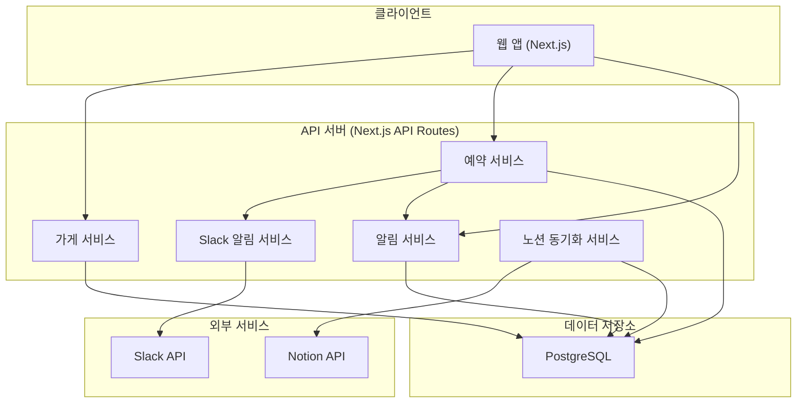
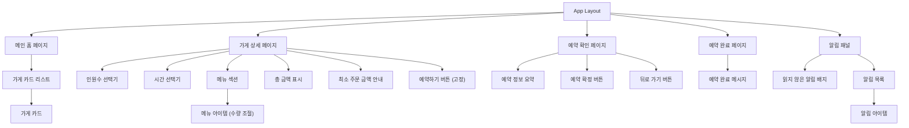
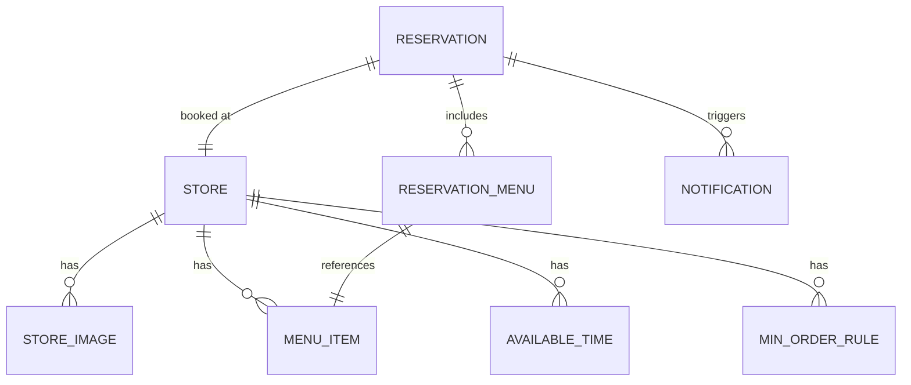

# 기술 설계 문서: 단체 예약 플랫폼

## 개요

단체 예약 플랫폼은 사용자가 메인 홈에서 가게 카드를 탐색하고, 상세 화면에서 인원/시간 선택 및 메뉴 추가 후 예약을 진행하는 간소화된 단체 예약 서비스이다. 가게 데이터는 노션에서 관리하며 플랫폼에 동기화하는 방식으로 운영된다. 예약이 접수되면 Slack을 통해 운영팀에 알림이 전달되며, 운영팀은 수락/거절 및 추가 안내사항을 전달할 수 있다. 운영팀의 처리 결과는 사이트 내 알림을 통해 사용자에게 전달된다.

핵심 흐름:
1. 운영팀이 노션에서 가게 데이터 관리 → 플랫폼에 동기화
2. 사용자가 메인 홈에서 가게 카드 탐색
3. 가게 카드 클릭 → 상세 화면에서 인원/시간 선택 + 메뉴 추가 (최소 주문 금액 충족 필요)
4. "예약하기" 클릭 → 예약 확인 화면 → "예약 확정" 클릭
5. 운영팀에 Slack 알림 → 수락/거절/추가 안내사항 전달
6. 운영팀 수락/거절 → 사이트 내 알림으로 사용자에게 결과 전달

## 아키텍처

### 시스템 아키텍처



### 기술 스택

- **프론트엔드**: Next.js (App Router), TypeScript, Tailwind CSS
- **백엔드**: Next.js API Routes
- **데이터베이스**: PostgreSQL
- **외부 연동**: Slack API (Incoming Webhooks + Interactive Messages), Notion API (데이터베이스 연동)
- **배포**: Vercel

## 컴포넌트 및 인터페이스

### 프론트엔드 컴포넌트 구조



### API 인터페이스

#### 가게 관련 API

```typescript
// GET /api/stores - 메인 홈 가게 리스트
interface GetStoresResponse {
  stores: StoreCard[];
}

interface StoreCard {
  id: string;
  name: string;
  images: string[];
  availableTimes: string[];    // 예약 가능한 시간 목록
  maxCapacity: number;         // 최대 수용 가능 인원
  minOrderRules: MinOrderRule[]; // 인원수 기반 최소 주문 금액 규칙
}

// 인원수 기반 최소 주문 금액 규칙
interface MinOrderRule {
  minHeadcount: number;        // 최소 인원수
  maxHeadcount: number;        // 최대 인원수
  minOrderAmount: number;      // 최소 주문 금액 (원)
}

// GET /api/stores/:id - 가게 상세
interface GetStoreDetailResponse {
  store: StoreDetail;
  menus: MenuItemData[];
  availableTimes: string[];
}

interface StoreDetail {
  id: string;
  name: string;
  images: string[];
  maxCapacity: number;
  availableTimes: string[];
  minOrderRules: MinOrderRule[]; // 인원수 기반 최소 주문 금액 규칙
}

interface MenuItemData {
  id: string;
  name: string;
  price: number;
  category?: string;
}
```

#### 예약 관련 API

```typescript
// POST /api/reservations - 예약 접수
interface CreateReservationRequest {
  storeId: string;
  headcount: number;
  time: string;
  menuItems: { menuId: string; quantity: number }[];
  totalAmount: number;
  minOrderAmount: number;      // 인원수 기반 최소 주문 금액
}

interface CreateReservationResponse {
  reservationId: string;
  status: 'pending';
}

// POST /api/reservations/:id/respond - Slack에서 운영팀 응답
interface RespondReservationRequest {
  action: 'accept' | 'reject';
  note?: string;               // 추가 안내사항
}
```

#### Slack 알림 API

```typescript
// Slack Incoming Webhook payload
interface SlackReservationNotification {
  storeName: string;
  headcount: number;
  time: string;
  menuItems: { name: string; quantity: number; price: number }[];
  totalAmount: number;
  minOrderAmount: number;
  reservationId: string;
  // Slack Interactive Message actions: 수락, 거절 버튼
  // 추가 안내사항 입력 필드
}
```

#### 알림 관련 API

```typescript
// GET /api/notifications - 사용자 알림 목록 조회
interface GetNotificationsResponse {
  notifications: NotificationData[];
  unreadCount: number;
}

interface NotificationData {
  id: string;
  reservationId: string;
  storeName: string;
  type: 'accepted' | 'rejected';
  message: string;             // "예약이 확정되었습니다" 또는 "예약이 거절되었습니다"
  adminNote?: string;          // 운영팀 추가 안내사항
  isRead: boolean;
  createdAt: Date;
}

// PATCH /api/notifications/:id/read - 알림 읽음 처리
interface MarkNotificationReadResponse {
  id: string;
  isRead: true;
}
```

#### 노션 동기화 API

```typescript
// POST /api/admin/sync-notion - 노션 데이터 동기화
interface SyncNotionRequest {
  notionDatabaseId: string;
}

interface SyncNotionResponse {
  syncedStores: number;
  errors: string[];
  lastSyncedAt: Date;
}

// 노션 데이터베이스 스키마 (노션에서 관리하는 가게 데이터 구조)
interface NotionStoreData {
  name: string;
  images: string[];
  menus: { name: string; price: number; category?: string }[];
  availableTimes: string[];
  maxCapacity: number;
  minOrderRules: { minHeadcount: number; maxHeadcount: number; minOrderAmount: number }[];
}
```

## 데이터 모델

### ER 다이어그램



### 엔티티 정의

```typescript
// 가게
interface Store {
  id: string;
  name: string;
  maxCapacity: number;
  notionPageId?: string;       // 노션 페이지 ID (동기화 추적용)
  lastSyncedAt?: Date;         // 마지막 노션 동기화 시각
  createdAt: Date;
  updatedAt: Date;
}

// 가게 이미지
interface StoreImage {
  id: string;
  storeId: string;
  imageUrl: string;
  displayOrder: number;
}

// 예약 가능 시간
interface AvailableTime {
  id: string;
  storeId: string;
  time: string;                // HH:mm 형식
  isAvailable: boolean;
}

// 메뉴 아이템
interface MenuItem {
  id: string;
  storeId: string;
  name: string;
  price: number;
  category?: string;
}

// 인원수 기반 최소 주문 금액 규칙
interface MinOrderRule {
  id: string;
  storeId: string;
  minHeadcount: number;        // 최소 인원수
  maxHeadcount: number;        // 최대 인원수
  minOrderAmount: number;      // 최소 주문 금액 (원)
}

// 예약
interface Reservation {
  id: string;
  storeId: string;
  headcount: number;
  time: string;
  totalAmount: number;
  status: 'pending' | 'accepted' | 'rejected';
  adminNote?: string;          // 운영팀 추가 안내사항
  createdAt: Date;
  updatedAt: Date;
}

// 예약 메뉴
interface ReservationMenu {
  id: string;
  reservationId: string;
  menuItemId: string;
  quantity: number;
  priceAtTime: number;         // 예약 시점의 메뉴 가격
}

// 사이트 내 알림
interface Notification {
  id: string;
  reservationId: string;
  type: 'accepted' | 'rejected';
  message: string;             // "예약이 확정되었습니다" 또는 "예약이 거절되었습니다"
  adminNote?: string;          // 운영팀 추가 안내사항
  isRead: boolean;
  createdAt: Date;
}
```

### 예약 유효성 검증 로직

```typescript
interface ValidationResult {
  valid: boolean;
  errors: string[];
}

// 인원수에 따른 최소 주문 금액 조회
function getMinOrderAmount(
  headcount: number,
  rules: MinOrderRule[]
): number {
  const rule = rules.find(r => headcount >= r.minHeadcount && headcount <= r.maxHeadcount);
  return rule ? rule.minOrderAmount : 0;
}

// 예약 요청 유효성 검증
function validateReservationRequest(
  req: Partial<CreateReservationRequest>,
  store: Store,
  availableTimes: string[],
  minOrderRules: MinOrderRule[]
): ValidationResult {
  const errors: string[] = [];
  if (!req.headcount || req.headcount < 1) errors.push('인원수를 선택해주세요.');
  if (req.headcount && req.headcount > store.maxCapacity) {
    errors.push(`최대 수용 가능 인원은 ${store.maxCapacity}명입니다.`);
  }
  if (!req.time) errors.push('시간을 선택해주세요.');
  if (req.time && !availableTimes.includes(req.time)) {
    errors.push('선택한 시간은 예약이 불가능합니다.');
  }
  // 최소 주문 금액 검증
  if (req.headcount && req.totalAmount !== undefined) {
    const minAmount = getMinOrderAmount(req.headcount, minOrderRules);
    if (req.totalAmount < minAmount) {
      errors.push(`${req.headcount}명 기준 최소 주문 금액은 ${minAmount.toLocaleString()}원입니다. 현재 ${req.totalAmount.toLocaleString()}원 (${(minAmount - req.totalAmount).toLocaleString()}원 부족)`);
    }
  }
  return { valid: errors.length === 0, errors };
}

// 메뉴 총 금액 계산
function calculateTotalAmount(
  menuItems: { menuId: string; quantity: number }[],
  menuData: MenuItem[]
): number {
  return menuItems.reduce((total, item) => {
    const menu = menuData.find(m => m.id === item.menuId);
    return total + (menu ? menu.price * item.quantity : 0);
  }, 0);
}
```

### Slack 알림 로직

```typescript
// Slack Interactive Message 구성
function buildSlackMessage(reservation: Reservation, store: Store, menus: ReservationMenu[]): object {
  return {
    text: `🔔 새 예약 신청 도착!`,
    blocks: [
      {
        type: 'section',
        text: {
          type: 'mrkdwn',
          text: `*가게:* ${store.name}\n*인원:* ${reservation.headcount}명\n*시간:* ${reservation.time}\n*총 금액:* ${reservation.totalAmount.toLocaleString()}원`
        }
      },
      {
        type: 'section',
        text: {
          type: 'mrkdwn',
          text: `*선택 메뉴:*\n${menus.map(m => `• ${m.name} x${m.quantity}`).join('\n')}`
        }
      },
      {
        type: 'actions',
        elements: [
          { type: 'button', text: { type: 'plain_text', text: '✅ 수락' }, action_id: 'accept_reservation', value: reservation.id },
          { type: 'button', text: { type: 'plain_text', text: '❌ 거절' }, action_id: 'reject_reservation', value: reservation.id, style: 'danger' }
        ]
      },
      {
        type: 'input',
        element: { type: 'plain_text_input', action_id: 'admin_note', placeholder: { type: 'plain_text', text: '추가 안내사항을 입력하세요...' } },
        label: { type: 'plain_text', text: '추가 안내사항' },
        optional: true
      }
    ]
  };
}
```


### 사이트 내 알림 생성 로직

```typescript
// 예약 상태 변경 시 사이트 내 알림 생성
function createNotificationForReservation(
  reservation: Reservation,
  action: 'accept' | 'reject',
  adminNote?: string
): Notification {
  return {
    id: generateId(),
    reservationId: reservation.id,
    type: action === 'accept' ? 'accepted' : 'rejected',
    message: action === 'accept' ? '예약이 확정되었습니다' : '예약이 거절되었습니다',
    adminNote: adminNote,
    isRead: false,
    createdAt: new Date(),
  };
}

// 읽지 않은 알림 개수 조회
function getUnreadNotificationCount(notifications: Notification[]): number {
  return notifications.filter(n => !n.isRead).length;
}
```


## 정확성 속성 (Correctness Properties)

### Property 1: 노션 데이터 동기화 정합성

*For any* 노션_데이터_소스의 가게 데이터에 대해, 동기화 후 플랫폼 데이터베이스에 저장된 가게 정보(이름, 사진, 메뉴, 시간, 최소 주문 금액 규칙)는 노션 원본 데이터와 일치해야 한다.

**Validates: Requirements 1.1, 1.2, 1.4**

### Property 2: 가게 카드 필수 정보 포함

*For any* 가게 데이터에 대해, 메인 홈 가게_카드에는 가게 이름, 가게 사진(1장 이상), 예약 가능한 시간 목록, 최대 수용 가능 인원이 반드시 포함되어야 한다.

**Validates: Requirements 2.2, 2.3, 2.4, 2.5**

### Property 3: 인원수 상한 제한

*For any* 가게와 인원수 입력에 대해, 사용자가 선택한 인원수가 해당 가게의 최대 수용 가능 인원을 초과하면 유효성 검증은 반드시 실패해야 하고, 최대 수용 가능 인원을 안내하는 에러 메시지를 반환해야 한다.

**Validates: Requirements 3.2, 3.3**

### Property 4: 예약 가능 시간만 선택 가능

*For any* 가게의 시간 선택에 대해, 사용자가 선택할 수 있는 시간은 해당 가게의 예약 가능한 시간 목록에 포함된 시간만이어야 한다.

**Validates: Requirements 3.5**

### Property 5: 메뉴 총 금액 계산 정확성

*For any* 메뉴 선택 조합에 대해, 표시되는 총 금액은 각 메뉴의 (가격 × 수량)의 합과 정확히 일치해야 한다.

**Validates: Requirements 4.3, 4.4**

### Property 6: 최소 주문 금액 검증

*For any* 인원수와 메뉴 선택 조합에 대해, 선택한 메뉴의 총 금액이 해당 인원수에 대한 최소_주문_금액 미만이면 예약 확정은 반드시 차단되어야 하고, 부족한 금액을 안내하는 메시지를 반환해야 한다.

**Validates: Requirements 4.5, 4.6, 5.7**

### Property 7: 예약 필수 조건 검증

*For any* 예약 요청에 대해, 인원수가 선택되지 않았거나 시간이 선택되지 않은 경우 예약 진행은 반드시 차단되어야 하고, 누락된 항목을 안내하는 에러 메시지를 반환해야 한다.

**Validates: Requirements 4.8, 4.9**

### Property 8: 예약 확인 화면 필수 정보 표시

*For any* 예약 데이터에 대해, 예약 확인 화면에는 가게 이름, 선택한 인원수, 선택한 시간, 선택한 메뉴 목록, 총 금액, 최소 주문 금액 충족 여부가 반드시 포함되어야 한다.

**Validates: Requirements 5.1, 5.2, 5.3, 5.4, 5.5, 5.6**

### Property 9: 예약 상태 전이 유효성

*For any* 예약 상태 변경 요청에 대해, 허용된 상태 전이(pending→accepted, pending→rejected)만 성공해야 하며, 유효하지 않은 상태 전이는 거부되어야 한다.

**Validates: Requirements 6.4, 6.5, 6.9**

### Property 10: Slack 알림 필수 정보 포함

*For any* 예약 접수에 대해, Slack 알림에는 가게 이름, 예약 인원수, 예약 시간, 선택한 메뉴 목록, 총 금액이 반드시 포함되어야 한다.

**Validates: Requirements 6.2**

### Property 11: Slack 수락/거절 액션 제공

*For any* Slack 알림에 대해, "수락" 및 "거절" 액션 버튼이 반드시 포함되어야 한다.

**Validates: Requirements 6.3**

### Property 12: 추가 안내사항 저장

*For any* 운영팀의 추가 안내사항 입력에 대해, 입력된 안내사항은 해당 예약 정보에 반드시 저장되어야 한다.

**Validates: Requirements 6.6, 6.7**

### Property 13: 인원수 기반 최소 주문 금액 조회 정확성

*For any* 인원수와 최소 주문 금액 규칙 목록에 대해, getMinOrderAmount 함수는 해당 인원수가 속하는 구간의 최소 주문 금액을 정확히 반환해야 한다.

**Validates: Requirements 1.4, 3.6**

### Property 14: 사이트 내 알림 생성 정확성

*For any* 예약 상태 변경(수락 또는 거절)에 대해, 사이트_내_알림이 반드시 생성되어야 하며, 알림 타입은 예약 상태와 일치해야 한다. 수락 시 "예약이 확정되었습니다", 거절 시 "예약이 거절되었습니다" 메시지를 포함해야 한다.

**Validates: Requirements 7.1, 7.2**

### Property 15: 사이트 내 알림 안내사항 포함

*For any* 운영팀이 추가 안내사항을 입력한 예약 상태 변경에 대해, 생성된 사이트_내_알림에는 운영팀 안내사항이 반드시 포함되어야 한다.

**Validates: Requirements 7.3**

### Property 16: 알림 읽음 상태 관리

*For any* 사이트_내_알림에 대해, 사용자가 알림을 확인하면 해당 알림의 읽음 상태가 true로 변경되어야 하며, 읽지 않은 알림 개수는 정확히 isRead가 false인 알림의 수와 일치해야 한다.

**Validates: Requirements 7.5, 7.6**


## 에러 처리

### 클라이언트 에러

| 에러 상황 | 처리 방식 | HTTP 상태 |
|-----------|-----------|-----------|
| 인원수 미선택 후 예약 시도 | 인원수 선택 요청 안내 메시지 표시 | 400 |
| 시간 미선택 후 예약 시도 | 시간 선택 요청 안내 메시지 표시 | 400 |
| 최대 수용 인원 초과 | 최대 수용 인원 안내 메시지 표시 | 400 |
| 최소 주문 금액 미달 | 부족한 금액 안내 메시지 표시, 예약 확정 버튼 비활성화 | 400 |
| 예약 불가능한 시간 선택 | "해당 시간은 예약이 불가능합니다" 메시지 표시 | 400 |
| 존재하지 않는 가게 접근 | 404 페이지로 리다이렉트 | 404 |

### 서버 에러

| 에러 상황 | 처리 방식 | HTTP 상태 |
|-----------|-----------|-----------|
| 데이터베이스 연결 실패 | 재시도 후 "일시적인 오류" 메시지 표시 | 503 |
| Slack 알림 발송 실패 | 재시도 큐에 등록 (최대 3회, 지수 백오프) | 500 (내부) |
| 노션 API 연동 실패 | 오류 메시지 표시, 기존 데이터 유지 | 503 |
| 등록된 가게 없음 | "현재 등록된 가게가 없습니다" 안내 메시지 표시 | 200 (빈 배열) |


## 테스트 전략

### 단위 테스트 (Unit Tests)

**대상 영역:**
- 예약 유효성 검증 함수 (`validateReservationRequest`)
- 메뉴 총 금액 계산 함수 (`calculateTotalAmount`)
- 인원수 기반 최소 주문 금액 조회 함수 (`getMinOrderAmount`)
- 예약 상태 전이 로직
- Slack 메시지 빌더 함수 (`buildSlackMessage`)
- 노션 데이터 동기화 로직
- 알림 생성 로직 (예약 상태 변경 시 사이트 내 알림 생성)
- 알림 읽음 상태 관리 로직

**엣지 케이스:**
- 인원수 0 또는 음수 입력
- 최대 수용 인원 초과 입력
- 메뉴 수량 0인 항목 포함
- 등록된 가게가 없는 경우
- 최소 주문 금액 규칙이 없는 가게
- 인원수가 어떤 최소 주문 금액 구간에도 해당하지 않는 경우
- 노션 API 응답 실패 시 기존 데이터 유지
- 알림 생성 시 예약이 존재하지 않는 경우
- 이미 읽은 알림을 다시 읽음 처리하는 경우 (멱등성)

### 속성 기반 테스트 (Property-Based Tests)

**라이브러리:** `fast-check`

**설정:**
- 각 속성 테스트는 최소 100회 반복 실행
- 태그 형식: `Feature: group-reservation-platform, Property {number}: {property_text}`

**속성 테스트 목록:**

1. **Property 1 테스트**: 임의의 노션 가게 데이터 생성 → 동기화 후 플랫폼 데이터 일치 확인
2. **Property 2 테스트**: 임의의 가게 데이터 생성 → 카드에 필수 정보 포함 확인
3. **Property 3 테스트**: 임의의 가게/인원수 조합 생성 → 초과 시 검증 실패 확인
4. **Property 4 테스트**: 임의의 시간 선택 생성 → 예약 가능 시간만 허용 확인
5. **Property 5 테스트**: 임의의 메뉴/수량 조합 생성 → 총 금액 계산 정확성 확인
6. **Property 6 테스트**: 임의의 인원수/메뉴 조합 생성 → 최소 주문 금액 미달 시 차단 확인
7. **Property 7 테스트**: 임의의 예약 요청 생성 → 필수 조건 누락 시 차단 확인
8. **Property 8 테스트**: 임의의 예약 데이터 생성 → 확인 화면 필수 정보 포함 확인
9. **Property 9 테스트**: 임의의 상태 전이 요청 생성 → 유효한 전이만 성공 확인
10. **Property 10 테스트**: 임의의 예약 생성 → Slack 알림 필수 정보 포함 확인
11. **Property 11 테스트**: 임의의 Slack 알림 생성 → 수락/거절 버튼 포함 확인
12. **Property 12 테스트**: 임의의 안내사항 입력 → 예약 정보에 저장 확인
13. **Property 13 테스트**: 임의의 인원수/규칙 조합 생성 → 최소 주문 금액 조회 정확성 확인
14. **Property 14 테스트**: 임의의 예약 상태 변경 생성 → 사이트 내 알림 생성 및 메시지 정확성 확인
15. **Property 15 테스트**: 임의의 안내사항 포함 상태 변경 생성 → 알림에 안내사항 포함 확인
16. **Property 16 테스트**: 임의의 알림 읽음 처리 생성 → 읽음 상태 변경 및 읽지 않은 개수 정확성 확인

### 통합 테스트

- 노션 데이터 동기화 → 가게 목록 반영 전체 흐름
- 가게 목록 조회 → 상세 화면 → 메뉴 선택 (최소 주문 금액 검증) → 예약 확인 → 예약 확정 전체 흐름
- 예약 접수 → Slack 알림 → 수락/거절 처리 전체 흐름
- 예약 접수 → Slack 알림 → 수락/거절 → 사이트 내 알림 생성 → 사용자 알림 조회 전체 흐름
- Slack API 연동 테스트 (Mock 사용)
- Notion API 연동 테스트 (Mock 사용)
